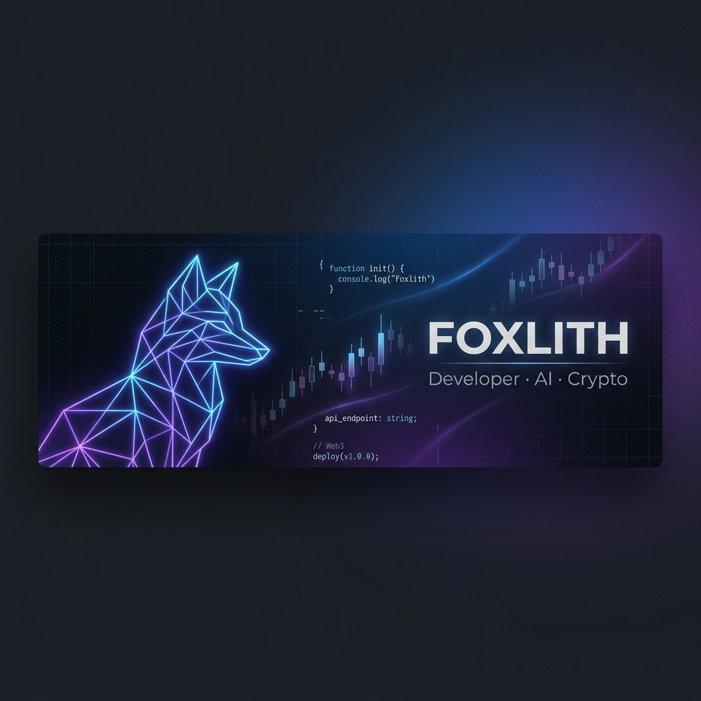

---

### 👋 Hey, soy **Fox**!

Desarrollador apasionado por la tecnología, la inteligencia artificial y las criptomonedas. Actualmente construyendo bots de trading automatizados con IA local y explorando el mundo de la automatización.

- 🦊 Creador de [**FoxTrading Bot**](https://github.com/Foxlith/bot-trading) — Bot de trading con IA que tiene 95%+ win rate
- 🧠 Experimentando con **IA local (Ollama)** para análisis de mercado en tiempo real
- 🐍 Python es mi lenguaje principal, pero también trabajo con **JavaScript** y **CSS**
- 📚 Estudiante de Ingeniería en la **CUN** 🇨🇴
- 🎮 En mi tiempo libre: gaming, aprender cosas nuevas, y automatizar TODO

---

### 🛠️ Tech Stack

---

### 🚀 Proyecto Destacado

> 🦊 **FoxTrading** — Bot de trading automatizado con 3 estrategias (DCA + Grid + Técnica) y un analista de IA local que evalúa cada operación. +95% win rate en paper trading.

---

### 📊 GitHub Stats

### 📈 Activity

---

**"El mejor momento para empezar fue ayer. El segundo mejor momento es ahora."** 🦊

